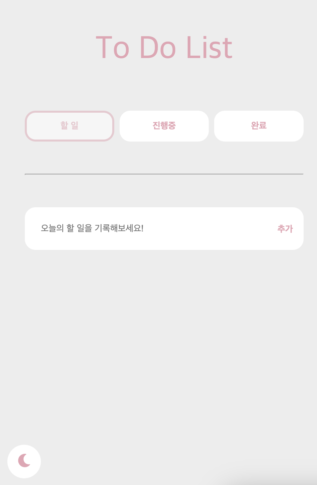

# TO DO LIST

오늘의 할 일을 기록해보세요!

## Skills

    
    
     
    

## Library

입력한 리스트, 다크 모드 테마를 효율적으로 추적, 관리하기 위해 recoil을 사용하였습니다.

입력 데이터의 유효성 검사를 효율적으로 하기 위해 react-hook-form을 사용하였습니다.

입력 데이터를 영구적으로 저장하기 위해 react-persist를 사용하였습니다.

스타일에 대한 가독성을 높이고자 styled-components를 사용하였습니다.

리액트 컴포넌트에 적합한 아이콘을 사용하고자 react-icons를 사용하였습니다.